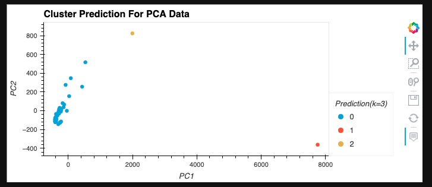

# Crypto Portfolio Management
A Crypto Portfolio Management application is created using financial Python programming and unsupervised learning

---

## Technologies

This application works on python 3.7 and uses following libraries:

* [matplotlib](https://github.com/matplotlib/matplotlib.git) - For creating static, animated, and interactive visualizations.

* [numpy](https://numpy.org/doc/stable/) - Numpy is a Python library that provides fundamental package for scientific computing in Python.

* [hvplot]() - 

* [sklearn]() - 

---


## Installation Guide

Follow the following instructions before using the application.

```python
  pip install numpy
  pip install -U matplotlib
```
---

## Detailed Explanation

1. ### Importing the Data

Loading the data from csv file into a new DataFrame.

  
  

---

2. ### Preparing the Data

The data is normalised using `StandardScaler` module from scikit-learn before running the K-Means algorithm.

    

---

3. ### Finding the Best Value for k Using the Original Data

Using the elbow method to find the best value for `k`(ranging from 1 to 11) and visually identifying the optimal value for `k` with line plot of all inertia values.

   
   

---

4. ### Clustering Cryptocurrencies with K-means Using the Original Data

Using the K-Means algorithm with the best value for `k` found in the previous section to cluster the cryptocurrencies according to the price changes of cryptocurrencies provided.

1. The K-Means model is initialized with using the best value for `k`(ie., four clusters). 

2. The K-Means model is fit using the original data.

3. The cluster grouping of the cryptocurrencies using the original data is then predicted

4. A New Dataframe is created with a copy of the original data and a new column with the predicted clusters.

   

---

5. ### Optimizing Clusters with Principal Component Analysis

In this section we perform a principal component analysis (PCA) to reduce the features to three principal components.

1. A PCA model instance is created with `n_components=3`.

2. Using the PCA model to reduce to three principal components.

3. Retrieving the explained variance to determine how much information can be attributed to each principal component.

   

5. Creating a new DataFrame with the PCA data with `coin_id` index from the original DataFrame as the index for the new DataFrame.

   

---

6. ### Finding the Best Value for k Using the PCA Data

Using the elbow method to find the best value for k for the PCA data(ranging from 1 to 11) and visually identifying the optimal value for k with line plot of all inertia values.

   

---

7. ### Clustering Cryptocurrencies with K-means Using the PCA Data

In this section, we use the PCA data and the K-Means algorithm with the best value for `k` found in the previous section to cluster the cryptocurrencies according to the principal components.

1. Initializing the K-Means model with clusters using the best value for `k`(`3` in this case). 

2. The K-Means model is fit using the PCA data.

3. The cluster grouping of the cryptocurrencies using the PCA data is then predicted

4. A New Dataframe is created with a copy of the PCA data and a new column with the predicted clusters of the PCA data.

5. Creating a scatter plot using hvPlot.

   

---

8. ### Visualizing and Comparing the Results

In this section, we will visually analyze the cluster analysis results by contrasting the outcome with and without using the optimization techniques.

1. Creating a composite plot to contrast the Elbow Curve plot which we used to predict the best value for `k` with the original and the PCA data.

   

2. Creating a composite plot to contrast the cryptocurrencies clusters using the original and the PCA data.

   
